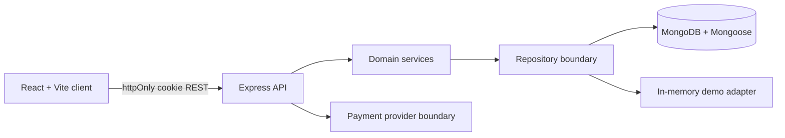

# Eventra Technical Requirements

## Architecture

The current runnable adapter is deterministic in-memory storage seeded with events. `server/src/models.ts` defines the Mongoose persistence boundary for the production adapter, but Mongo connection/repository wiring remains a release task requiring real credentials and deployment configuration. This keeps local verification runnable without pretending demo state is durable.

## Stack

- TypeScript strict mode across client, server, and shared contracts.
- React 18 + Vite + React Router.
- Express + Zod + Helmet + rate limiting + bcryptjs + JWT cookies.
- MongoDB/Mongoose production adapter; in-memory demo adapter for local verification.
- CSS custom-property design tokens with a 4px spacing rhythm.

## API Contract

All errors use `{ error: { code, message, details? } }`.

| Method | Route | Auth | Purpose |
|---|---|---|---|
| POST | `/api/auth/register` | Public | Create an account |
| POST | `/api/auth/login` | Public | Create an access session |
| POST | `/api/auth/logout` | Public | Clear session |
| GET | `/api/auth/me` | User | Read current user |
| GET | `/api/events` | Public | Paginated discovery |
| GET | `/api/events/:id` | Public | Event details |
| POST | `/api/events` | Organizer | Create event |
| GET | `/api/organizer/events` | Organizer/Admin | List owned event desk |
| POST | `/api/events/:id/publish` | Organizer/Admin | Publish event |
| POST | `/api/bookings/hold` | User | Hold inventory |
| POST | `/api/payments/create` | User | Create demo payment |
| POST | `/api/payments/verify` | User | Verify payment and create booking |
| GET | `/api/bookings` | User | List own bookings |
| GET | `/api/tickets/:id` | User/Staff | Read ticket |
| POST | `/api/tickets/validate` | Staff/Organizer/Admin | Redeem ticket |
| GET | `/api/admin/summary` | Admin | Platform overview |
| GET | `/api/admin/events` | Admin | Moderation queue |

## Security Invariants

- Passwords are bcrypt-hashed and never returned.
- JWT access tokens are stored in httpOnly, sameSite cookies.
- All request bodies and query params are parsed by Zod at the route boundary.
- Authorization checks are server-side and resource-scoped.
- Helmet, explicit CORS, request size limits, and auth rate limiting are enabled.
- Demo payment verification is server-side and uses an idempotency key.
