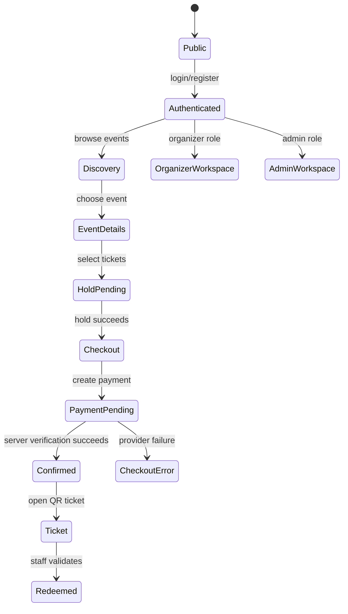

# Eventra App Flow

## Core State Rules

- Holds expire after 10 minutes and are released before availability is reported.
- A booking is created only once for an idempotency key and verified payment reference.
- A redeemed ticket cannot be redeemed again.
- Session expiry returns users to `/login` without exposing protected data.
